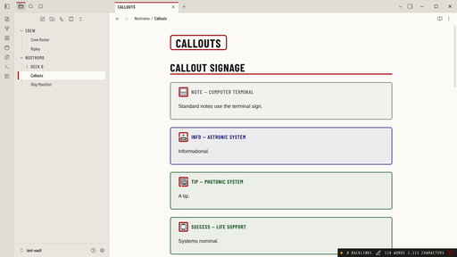

# Semiotic

An Obsidian theme based on Ron Cobb's **Semiotic Standard**, the signage he designed for the USCSS Nostromo in Ridley Scott's *Alien* (1979).



The light mode ("Nostromo day cycle") uses:
- off-white padded panels and bulkhead greys
- the signal palette taken straight from the symbols: red `#a00000`, grey `#606060`, amber `#ffb000`, cryo navy `#0a0a70`, organic green `#004411`
- stenciled condensed labels
- amber/black hazard chevrons

A first-pass dark mode ("MU-TH-UR 6000") is included.

## What it changes

| Element | Treatment |
|---|---|
| Callouts | Every built-in callout gets a full-colour Semiotic sign as its icon (see below) |
| Headings | Barlow Condensed, uppercase. H1 has a red rule, H2 a red marker square, H3 is signal red |
| Inline title | Framed like a sign plate |
| `---` rules | Amber/black hazard chevrons |
| Checkboxes | Square, red-framed |
| Tags | Mono uppercase label plates |
| Tabs | Squared off; the active tab has a red top edge |
| Sidebar | Folders read as deck labels; the active file gets a red frame edge |
| Status bar | A control-panel readout with an indicator lamp |
| New tab | Bridge sign with the Nostromo's hull registration |
| Code | Share Tech Mono, with syntax in the signal colours |

## Callouts

### Built-in types

| Callout | Sign |
|---|---|
| `note` | 030 Computer terminal |
| `abstract` / `summary` / `tldr` | 029 Storage |
| `info` | 011 Astronic system |
| `todo` | 020 Direction |
| `tip` / `hint` / `important` | 009 Photonic system |
| `success` / `check` / `done` | 021 Life support |
| `question` / `help` / `faq` | 025 Autodoc |
| `warning` / `caution` / `attention` | 012 Hazard warning |
| `failure` / `fail` / `missing` | 007 Non-pressurised area beyond |
| `danger` / `error` | 017 Radiation hazard (plus a hazard band) |
| `bug` | 026 Maintenance |
| `example` | 024 Bridge |
| `quote` / `cite` | 028 Intercom |

### Semiotic types

Every symbol is also available as its own callout:

```md
> [!airlock] Airlock 2
> Cycle before opening.
```

| Callout | Sign | Callout | Sign |
|---|---|---|---|
| `pressurised` | 001 | `radiation` | 017 |
| `gravity` | 002 | `radioactive` | 018 |
| `gravity-absent` | 003 | `refrigeration` | 019 |
| `cryo` | 004 | `direction` | 020 |
| `airlock` | 005 | `direction-down` | 020A |
| `bulkhead` | 006 | `direction-right` | 020B |
| `vacuum` | 007 | `direction-left` | 020C |
| `suit-locker` | 008 | `life-support` | 021 |
| `photonic` | 009 | `galley` | 022 |
| `laser` | 010 | `coffee` | 023 |
| `astronic` | 011 | `bridge` | 024 |
| `hazard` | 012 | `autodoc` | 025 |
| `suit-required` | 013 | `maintenance` | 026 |
| `no-pressure` | 014 | `ladderway` | 027 |
| `exhaust` | 015 | `intercom` | 028 |
| `shielded` | 016 | `storage` | 029 |
| | | `storage-organic` | 029A |
| | | `terminal` | 030 |

Each sign is also exposed as a CSS variable for your own snippets, for example:

```css
.my-thing { background: var(--sem-icon-airlock) center / contain no-repeat; }
```

## Install (manual)

1. Copy `manifest.json` and `theme.css` into `<vault>/.obsidian/themes/Semiotic/`.
2. In Obsidian, go to **Settings → Appearance → Themes** and pick **Semiotic**.
3. Choose **Light** (recommended) or **Dark** as the base colour scheme.

## Development

`theme.css` is generated. Edit the files in `src/` instead:

| File | Contents |
|---|---|
| `src/tokens.css` | The raw palette per mode. It's portable, so reuse it when porting the theme to other apps |
| `src/theme.src.css` | The Obsidian mapping and component styling |
| `src/icons/` | Semiotic Standard SVGs |
| `src/fonts/` | Embedded woff2 fonts (Latin subset) |
| `scripts/build.mjs` | Inlines the icons and fonts as data URIs, generates the callout rules, runs safety checks, and writes `theme.css` |

To build once:

```bash
npm run build
```

To rebuild whenever `src/` changes:

```bash
npm run watch
```

The build has no dependencies. Before it writes anything, it fails if the output contains:
- `!important`
- `@import`
- any `url()` that isn't a `data:` URI
- script-like constructs

This keeps the theme offline-only and overridable, as the community-theme guidelines require.

### Colour roles

- **Accent** follows Obsidian's accent colour setting. This covers links, checkboxes, list markers, focus rings and the caret. It defaults to signal red.
- **Signage** always uses the fixed signal palette. This covers heading rules, sign-plate frames, tab and file edges, hazard stripes and the symbols.

`test-vault/` holds sample notes that exercise every styled element. Its theme folder symlinks to the built files.

## Credits

The Semiotic Standard symbols were designed by **Ron Cobb** for *Alien* (1979). The vector adaptations are by LouH, after Brandon Gamm, and are licensed under CC BY 4.0. Fonts are licensed under SIL OFL 1.1. See [THIRD_PARTY_NOTICES.md](THIRD_PARTY_NOTICES.md).

The theme code is MIT licensed (see [LICENSE](LICENSE)). This is a fan work, not affiliated with or endorsed by the rights holders of *Alien*.
